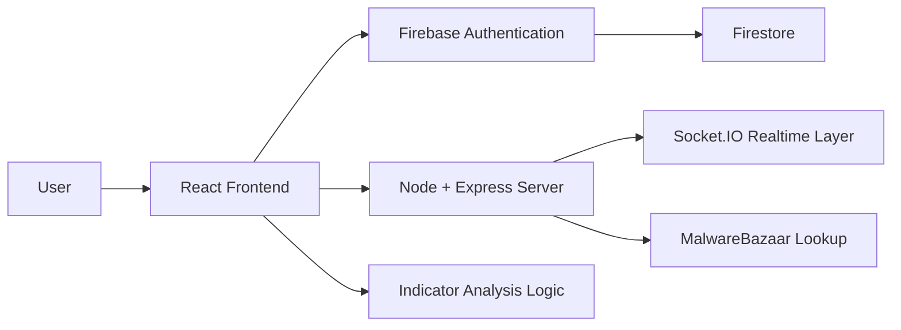
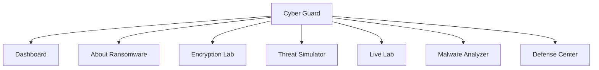
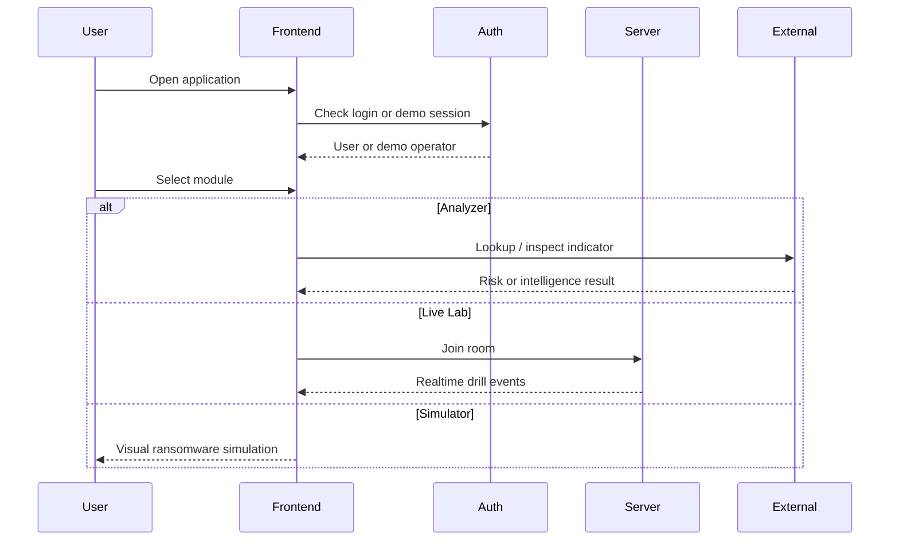

# CYBER GUARD: RANSOMWARE AWARENESS LAB

## Formal Project Report

### Submitted As A Detailed Academic Project Report

---

## Title Page

**Project Title:** Cyber Guard: Ransomware Awareness Lab  
**Project Type:** Cybersecurity Awareness and Training Web Application  
**Prepared For:** Academic Project Submission / Technical Documentation  
**Prepared By:** Student / Project Team  
**Department:** Computer Science / Information Technology / Cybersecurity  
**Institution:** ______________________________  
**Guide / Supervisor:** ______________________________  
**Academic Year:** ______________________________  

---

## Certificate

This is to certify that the project entitled **Cyber Guard: Ransomware Awareness Lab** is a bonafide work carried out as part of the academic requirement for the award of the relevant degree/diploma in the field of Computer Science / Information Technology / Cybersecurity.

**Project Guide Signature:** ____________________  
**Head of Department:** ____________________  
**Date:** ____________________  

---

## Declaration

I hereby declare that this project report entitled **Cyber Guard: Ransomware Awareness Lab** is an original work and has been carried out by me/us under proper guidance. The information and findings presented in this report are true to the best of my/our knowledge.

**Student Signature:** ____________________  
**Date:** ____________________  

---

## Acknowledgement

I would like to express my sincere gratitude to my project guide, faculty members, and institution for providing the support and guidance necessary for the successful completion of this project. I also acknowledge the role of open-source tools, modern web technologies, and cybersecurity learning resources that contributed to the development of this platform.

---

## Abstract

Cyber Guard: Ransomware Awareness Lab is a web-based cybersecurity education platform developed to improve awareness and understanding of ransomware threats through safe, interactive learning. The system combines theoretical explanation, visual attack-flow education, threat indicator analysis, safe ransomware simulation, and real-time incident-response drills in a single integrated environment. The project is designed to help users understand how ransomware attacks begin, escalate, affect business operations, and how defenders can respond effectively without exposing real systems to harm. The application is built using React, TypeScript, Vite, Node.js, Express, Firebase Authentication, Firestore, and Socket.IO. It supports both authenticated access and demo mode, making it suitable for academic presentation, awareness training, and local demonstrations. The major contribution of the project is that it transforms ransomware awareness from passive reading into active learning through guided, safe, and visually structured interaction.

---

## Table Of Contents

1. Introduction  
2. Problem Statement  
3. Objectives  
4. Scope Of The Project  
5. Literature And Conceptual Background  
6. Existing System And Proposed System  
7. System Architecture  
8. Technology Stack  
9. Module Description  
10. User Workflow  
11. Authentication And Access Design  
12. Interface And Visual Design  
13. Safety And Ethical Considerations  
14. Testing And Verification  
15. Challenges Faced  
16. Results And Outcomes  
17. Limitations  
18. Future Enhancements  
19. Conclusion  
20. Visual Evidence Appendix  

---

## 1. Introduction

Ransomware is one of the most serious cyber threats in the modern digital environment. It affects educational institutions, hospitals, businesses, government offices, and individuals by encrypting or blocking access to important data and systems. In many modern incidents, attackers also steal sensitive files, disable backups, and create financial and reputational pressure to force payment.

The aim of this project is to create an educational and interactive web platform where users can learn ransomware concepts, analyze suspicious indicators, observe safe simulations, and practice defender response in a controlled environment. Cyber Guard: Ransomware Awareness Lab is built as a practical learning system rather than a static content website.

---

## 2. Problem Statement

Most ransomware awareness resources are either:

- too theoretical and passive
- too limited to basic awareness posters and presentations
- too dangerous if they simulate offensive behavior carelessly

Because of this, learners often fail to connect definitions with real-world warning signs and response priorities. There is a need for a web platform that can teach ransomware concepts in a realistic but safe way.

This project addresses that need by building a secure, interactive, and educational ransomware learning environment.

---

## 3. Objectives

The objectives of the project are:

1. To design and develop a ransomware awareness web application.
2. To provide detailed educational content explaining ransomware attacks and business impact.
3. To implement safe ransomware simulation without any destructive capability.
4. To provide an analyzer for suspicious URLs, domains, IPs, hashes, and files.
5. To implement a live training lab for simulated incident response.
6. To support both demo-mode access and authenticated access.
7. To make the system suitable for academic presentation and practical awareness sessions.

---

## 4. Scope Of The Project

### Included Scope

- awareness website
- ransomware lifecycle explanation
- malware analyzer
- threat simulator
- live incident drill
- defense guidance
- theme customization
- local and tunnel-based demo support

### Excluded Scope

- real malware execution
- real peer attacking
- destructive local file changes
- offensive exploitation tools
- real unauthorized access workflows

---

## 5. Literature And Conceptual Background

Ransomware awareness requires understanding several linked concepts:

- phishing as an initial access vector
- privilege escalation and lateral movement
- data exfiltration before encryption
- cryptographic locking of files
- extortion pressure through ransom notes and downtime
- business continuity and backup recovery

This project integrates those concepts into separate but connected modules so users can learn both the theory and the practical meaning of a ransomware incident.

---

## 6. Existing System And Proposed System

### Existing System

Traditional awareness systems usually provide:

- static text explanation
- slideshow or PDF-based learning
- limited engagement
- no practical analysis tools
- no interactive incident workflow

### Proposed System

The proposed Cyber Guard platform offers:

- modular ransomware education
- safe simulation and visual training
- malware and indicator analysis
- real-time live drill environment
- login or demo usage
- theme customization and better presentation readiness

---

## 7. System Architecture

### 7.1 High-Level Architecture



### 7.2 Module Architecture



### 7.3 Runtime Flow



---

## 8. Technology Stack

| Category | Tools / Technologies |
|---|---|
| Frontend | React 19, TypeScript, Vite |
| Styling | Tailwind CSS v4, custom CSS variables |
| Backend | Node.js, Express |
| Realtime | Socket.IO |
| Authentication | Firebase Authentication |
| Database | Firestore |
| Analysis Support | Google GenAI integration, Safe Browsing logic, MalwareBazaar |
| Deployment | Localhost, ngrok, Cloud Run ready setup |

---

## 9. Module Description

### 9.1 Dashboard

The dashboard provides the main navigation surface and introduces the platform as a ransomware defense and awareness tool.

### 9.2 About Ransomware

This module explains ransomware, attack stages, operational impact, and includes a visual walkthrough of a ransomware incident.

### 9.3 Encryption Lab

This module explains how ransomware uses encryption to make data inaccessible and why recovery becomes difficult without clean backups or decryption keys.

### 9.4 Threat Simulator

This module visually simulates file encryption behavior, ransomware logging, ransom note generation, and the impact of different attacker profiles in a safe environment.

### 9.5 Live Lab

This module simulates a real-time ransomware drill using controller and defender roles, scenario progression, compromise visuals, alerts, telemetry, and containment scoring.

### 9.6 Malware Analyzer

This module inspects suspicious indicators such as URLs, domains, IP addresses, file hashes, and uploaded files. It highlights suspicious patterns and performs malware-oriented checks.

### 9.7 Defense Center

This module presents defense strategy, incident response guidance, and best practices for prevention, detection, and recovery.

---

## 10. User Workflow

The expected user interaction sequence is:

1. User opens the application.
2. User signs in with Google or uses demo mode.
3. User accesses the dashboard.
4. User selects a learning or training module.
5. User studies concepts or performs analysis.
6. User explores simulations or live drills.
7. User observes results and response outcomes.

---

## 11. Authentication And Access Design

The system supports:

### 11.1 Google Sign-In

Used for authenticated access through Firebase Authentication.

### 11.2 Demo Mode

Used for local demonstration and preview when Firebase login is not required.

This dual-mode access improves presentation flexibility and development convenience.

---

## 12. Interface And Visual Design

The interface is designed around clarity, modularity, and cybersecurity-themed emphasis. The project uses:

- strong section headers
- dashboard cards
- training overlays
- warning colors for incident pressure
- a theme toggle for white/light and black/dark customization

This allows the application to function both as a learning tool and as a polished presentation system.

---

## 13. Safety And Ethical Considerations

The project follows a strict safe-simulation model. It avoids:

- real attack functionality
- destructive host actions
- real system compromise
- peer targeting

All compromise effects are visual, educational, and controlled. This makes the system appropriate for academic and awareness use.

---

## 14. Testing And Verification

The project has been tested through:

- build verification using `npm.cmd run build`
- type checking using `npm.cmd run lint`
- localhost execution
- browser rendering checks
- process cleanup and restart validation
- sign-in flow handling
- UI module checks

---

## 15. Challenges Faced

Major challenges included:

- Firebase localhost sign-in restrictions
- stale old page assets and wrong app shell restoration
- CSS mismatch causing white-screen render issues
- balancing realism and safety in the live lab
- browser cache and stale localhost process conflicts

---

## 16. Results And Outcomes

The final application successfully delivers:

- a detailed ransomware awareness website
- interactive learning modules
- indicator inspection functionality
- safe ransomware simulation
- real-time training drills
- theme customization
- a project-ready presentation structure

---

## 17. Limitations

Current limitations include:

- Google sign-in requires Firebase console domain setup
- some intelligence checks depend on external APIs
- the platform is educational, not a forensic or enterprise response product
- live lab realism is visual and training-based rather than operational

---

## 18. Future Enhancements

Potential improvements include:

1. PDF export of reports
2. automated screenshot capture
3. instructor dashboards
4. richer drill branching
5. performance optimization through code splitting
6. formal printable report generation from the app itself

---

## 19. Conclusion

Cyber Guard: Ransomware Awareness Lab demonstrates how a modern web application can be used to educate users about ransomware in a safe, engaging, and structured manner. The platform integrates theory, analysis, simulation, and response practice in one environment, making it suitable for both learning and project presentation. Its key strength lies in making ransomware education interactive without crossing safety boundaries.

---

## 20. Visual Evidence Appendix

### 20.1 Architecture Visual

Use the Mermaid diagrams in this report as architecture visuals for the final document.

### 20.2 Screenshot Slots

The workspace currently does not contain screenshot image files to embed directly. Add screenshots in the following places for final submission:

1. Login page with theme toggle  
2. Dashboard overview  
3. About Ransomware page  
4. Malware Analyzer results page  
5. Threat Simulator ransom note  
6. Live Lab compromise drill  
7. Defense Center page  

### 20.3 Suggested Markdown Image Format

When screenshot files are available, add them like this:

```md


```

---

## Final Project Identity

- **Project Name:** Cyber Guard: Ransomware Awareness Lab
- **Project Category:** Cybersecurity Awareness and Training
- **Project Nature:** Safe educational web application
- **Primary Focus:** Ransomware awareness, analysis, simulation, and defender training
