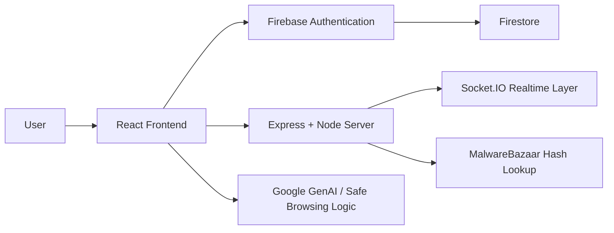
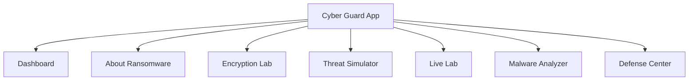
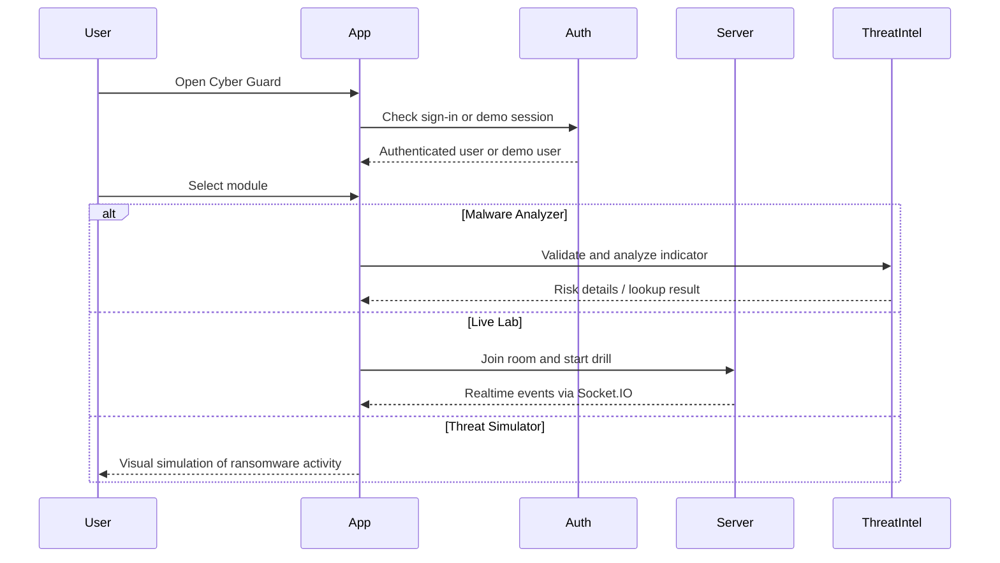
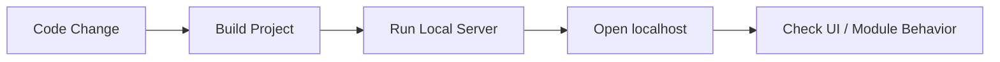

# Cyber Guard: Ransomware Awareness Lab

## Detailed Project Report

### Abstract

Cyber Guard: Ransomware Awareness Lab is an interactive cybersecurity awareness web application designed to educate users about ransomware threats through safe simulation, analysis, and defender-focused training. The platform combines educational content, threat indicator analysis, encryption concepts, phishing and malware inspection, and live incident drills within a single web-based interface. Unlike static awareness websites, this project provides hands-on learning through controlled scenarios that demonstrate how ransomware incidents begin, escalate, and impact business operations. The application is built with a modern React and Vite frontend, a Node.js and Express backend, Firebase-based authentication, and Socket.IO for real-time drill interactions. Its core value lies in transforming ransomware education from passive reading into active understanding by allowing users to analyze suspicious indicators, observe simulated encryption behavior, study ransomware workflows, and practice response decisions in a safe environment.

---

## 1. Introduction

Ransomware has become one of the most disruptive forms of cybercrime affecting businesses, institutions, and individuals. Modern ransomware attacks do not only encrypt files; they often involve credential abuse, backup disruption, data exfiltration, and extortion pressure. Because of this evolution, awareness alone is no longer sufficient unless it is combined with realistic learning and practical understanding.

Cyber Guard: Ransomware Awareness Lab was developed to address this gap. The project provides a centralized web platform where users can:

- understand ransomware concepts
- inspect suspicious indicators such as URLs, domains, IP addresses, file hashes, and uploaded files
- explore ransomware behavior through safe simulation
- observe business and operational impact
- practice defender response in controlled training drills

The result is a blended educational system that combines theory, simulation, and incident response practice.

---

## 2. Problem Statement

Traditional cybersecurity awareness tools often fail because they rely heavily on text-based explanations and lack interactivity. Users may understand definitions but still struggle to recognize suspicious signals or respond effectively during an incident. Existing training content may also be either too simplified for realistic learning or too dangerous if it crosses into offensive behavior.

This project solves that problem by delivering:

- safe ransomware education without real attack capability
- interactive simulation instead of passive content only
- practical indicator analysis tools
- real-time training views that mimic incident pressure
- a single platform that connects learning, analysis, and response

---

## 3. Objectives

The main objectives of the project are:

1. To build an educational web application for ransomware awareness.
2. To provide safe simulations that demonstrate ransomware impact without harming real systems.
3. To allow users to analyze suspicious threat indicators such as URLs, IPs, domains, hashes, and uploaded files.
4. To present a live training lab for ransomware incident response practice.
5. To support both demonstration mode and authenticated mode for flexible local use and deployment.
6. To make the platform visually engaging, educational, and suitable for student or awareness-lab presentation.

---

## 4. Scope of the Project

### Included

- ransomware awareness content
- attack lifecycle explanation
- threat simulator
- malware analyzer
- encryption lab
- defense center
- live incident drill
- theme toggle
- local and cloud-ready deployment support

### Excluded

- real offensive attack execution
- real peer compromise or reverse hacking
- destructive file encryption on host systems
- production-grade enterprise threat intelligence integration beyond configured APIs

---

## 5. Technology Stack

| Layer | Technology |
|---|---|
| Frontend | React 19, TypeScript, Vite |
| Styling | Tailwind CSS v4, custom theme variables |
| Backend | Node.js, Express |
| Realtime | Socket.IO |
| Authentication | Firebase Authentication |
| Database | Firestore |
| Threat Intelligence | Google GenAI integration, Safe Browsing logic, MalwareBazaar lookup |
| Deployment Support | Localhost, ngrok, Cloud Run readiness |

---

## 6. System Architecture

### 6.1 High-Level Architecture

### 6.2 Application Module Structure

---

## 7. Core Modules

### 7.1 Dashboard

The dashboard acts as the central navigation surface of the project. It introduces the purpose of the application and provides structured access to all other modules. It also presents ransomware as a business disruption problem rather than only a technical malware category.

Key responsibilities:

- module navigation
- overview of ransomware risk
- high-level awareness messaging
- user-friendly entry point into the platform

### 7.2 About Ransomware

This module explains what ransomware is, how attacks unfold, why organizations pay, and what business impact looks like. It includes a structured attack timeline and a demo-video-style walkthrough that visually presents typical stages such as phishing, privilege abuse, data staging, and encryption.

Key responsibilities:

- conceptual education
- attack lifecycle explanation
- abstract and business context support
- visual walkthrough of incident flow

### 7.3 Encryption Lab

The encryption lab explains the cryptographic basis behind ransomware. It helps users understand why encrypted data becomes inaccessible and how ransomware typically uses strong encryption methods to lock victims out of files.

Key responsibilities:

- explain encryption concepts
- connect cryptography to ransomware operations
- support technical learning objectives

### 7.4 Threat Simulator

The threat simulator provides a controlled, visual demonstration of file encryption and ransomware behavior. It allows users to observe simulated attack profiles, file state changes, logging, ransom note display, and recovery flow.

Key responsibilities:

- safe demonstration of ransomware impact
- different attack profile behavior
- simulated ransom note generation
- customizable ransom amount

### 7.5 Live Lab

The live lab is one of the most advanced modules in the project. It provides a real-time collaborative drill environment using Socket.IO. The drill includes attacker-controller behavior, defender actions, scenario artifacts, blast radius tracking, fake compromise visuals, alerts, telemetry, and after-action summaries.

Key responsibilities:

- real-time training
- defender-response practice
- scenario-based incident progression
- visual compromise simulation
- scoring and reporting

### 7.6 Malware Analyzer

This module analyzes threat indicators such as:

- URLs
- domains
- IP addresses
- file hashes
- uploaded files

It combines validation, Safe Browsing-style checks where applicable, regex pattern matching, suspicious component detection, and malware database lookup for hashes. The goal is to help users inspect indicators and understand why they appear safe or risky.

Key responsibilities:

- indicator validation
- suspicious component highlighting
- hash-based malware checking
- local file hashing
- analysis fallback even when AI services are unavailable

### 7.7 Defense Center

The defense center translates awareness into protection and response strategy. It organizes defensive concepts around prevention, detection, and incident response.

Key responsibilities:

- practical defense guidance
- structured response steps
- recovery and containment concepts

---

## 8. User Workflow

---

## 9. Authentication and Access Control

The project supports two access modes:

### 9.1 Google Sign-In

Users can authenticate using Firebase Authentication with Google sign-in. This supports a more realistic session model and Firestore-backed user history.

### 9.2 Demo Mode

Demo mode was added to ensure the project remains usable even when Firebase sign-in is unavailable locally or when cloud sync is not needed. This mode is useful for presentations, previews, and local testing.

Benefits:

- avoids blocking local demonstrations
- bypasses Firebase requirements during preview
- keeps the app accessible in classroom or offline demo contexts

---

## 10. Visual Design and User Experience

The application uses a structured, module-driven interface with strong visual contrast and learning-oriented layout patterns. It also includes a theme toggle so users can switch between light and dark presentation modes.

### Design principles used

- bold typography for module identity
- clear navigation hierarchy
- dashboard cards for entry clarity
- incident-themed colors for alerts and risk
- simulation overlays for realism in drills
- separate educational, analytical, and practical sections

### Theme Customization

The project includes a light/dark theme toggle stored in browser local storage. This improves accessibility and allows user preference without altering app logic.

---

## 11. Key Features Implemented

### Educational Features

- ransomware explanation module
- abstract attack timeline
- guided demo-video section
- encryption concept lab

### Simulation Features

- threat simulator with multiple attack profiles
- simulated ransom notes
- ransom amount customization
- safe live-lab compromise screen

### Analysis Features

- URL, domain, IP, hash, and file analysis
- suspicious component highlighting
- regex-based advanced pattern matching
- malware database hash lookup

### Live Training Features

- attacker-controller and defender roles
- room-based Socket.IO communication
- scenario artifacts and blast radius
- response scoring and after-action report
- visual and audible compromise alerts

### Usability Features

- demo mode fallback
- Google authentication support
- light/dark toggle
- localhost and tunnel-friendly setup

---

## 12. Safe Simulation Approach

One of the most important engineering goals of this project was maintaining safety. The platform avoids providing real offensive functionality while still giving users realistic awareness and response training.

Safe design choices include:

- no real payload execution
- no live peer attack functionality
- no destructive local file encryption
- no actual malware deployment
- visual-only compromise states
- training-only ransom messaging

This makes the project suitable for educational, awareness, and demonstration use.

---

## 13. Testing and Verification

The project has been repeatedly validated during development through:

- `npm.cmd run build`
- `npm.cmd run lint`
- localhost testing
- port verification
- UI recovery after stale process conflicts
- module-level functional checks

### Typical verification flow

---

## 14. Challenges Faced

Several practical issues were encountered during development:

### 14.1 Localhost Sign-In Problems

Firebase Google sign-in initially failed on localhost because the local domain was not authorized in Firebase Authentication.

### 14.2 Old Cached Page and Wrong App Shell

An older page version continued to appear due to stale assets, a wrong `App.tsx`, and port conflicts from previously running Node processes.

### 14.3 Style Mismatch

At one point, the active CSS belonged to an older splash screen, causing white-page and layout issues after the correct app shell was restored.

### 14.4 Realtime Drill Complexity

Balancing realism and safety in the live lab required careful scoping so the experience felt authentic without becoming offensive or destructive.

---

## 15. Outcomes

The final system successfully delivers:

- a unified ransomware education platform
- a visually structured cybersecurity awareness website
- safe ransomware simulation workflows
- indicator inspection capabilities
- a live response training environment
- a theme-customizable interface

This makes the project suitable for:

- academic project presentation
- cybersecurity awareness demonstration
- safe training sessions
- ransomware concept explanation for students or teams

---

## 16. Limitations

Although the project is feature-rich, some limitations remain:

- real Google sign-in still depends on Firebase console configuration
- malware intelligence depends on external API availability
- the analyzer is not a substitute for enterprise malware sandboxing
- live lab realism is visual and training-focused, not forensic-grade emulation
- very large frontend bundles may benefit from code-splitting optimization

---

## 17. Future Enhancements

Possible future improvements include:

1. instructor-grade reporting export in PDF format
2. automated screenshots and visual evidence capture for drills
3. more detailed incident scenarios and branching outcomes
4. richer dashboards for analyst metrics
5. code-splitting and performance optimization
6. stronger cloud deployment automation
7. optional student scoring and certificate generation

---

## 18. Conclusion

Cyber Guard: Ransomware Awareness Lab is a practical, educational, and safe cybersecurity web application focused on ransomware awareness and response understanding. It bridges the gap between theory and practice by combining conceptual learning, indicator analysis, simulated impact, and real-time defender drills in one platform. The project demonstrates how modern web technologies can be used to create a cybersecurity learning environment that is interactive, informative, and presentation-ready.

Its strongest contribution is not only explaining ransomware, but helping users experience the stages, signals, and response decisions that define a ransomware incident, all within a controlled and safe environment.

---

## Appendix A: Suggested Screenshots For Final Submission

To convert this report into a polished submission package, include screenshots of:

1. login page with theme toggle
2. dashboard overview
3. About Ransomware timeline
4. Malware Analyzer results
5. Threat Simulator ransom note
6. Live Lab compromise screen
7. Defense Center response guidance

---

## Appendix B: Project Identity

- **Project Name:** Cyber Guard: Ransomware Awareness Lab
- **Project Type:** Cybersecurity awareness and training web application
- **Primary Purpose:** Safe education, simulation, analysis, and response training for ransomware scenarios
